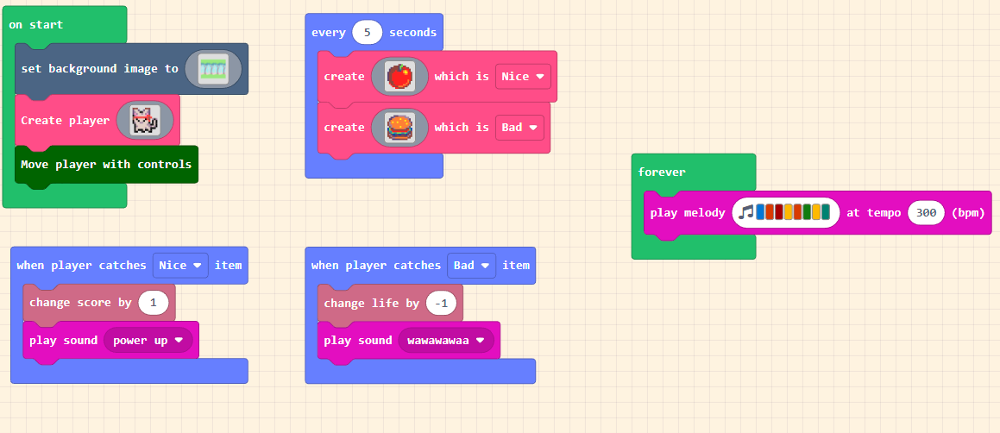
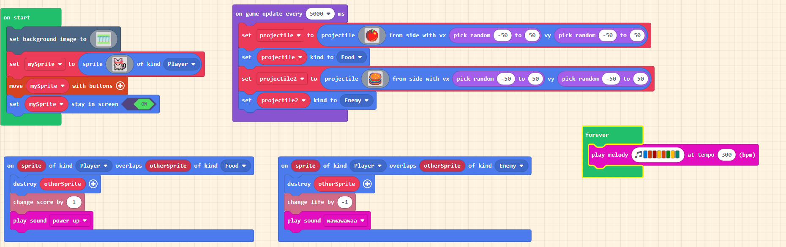

# MakeCode Tutorials

A collection of tutorials built on MakeCode Arcade.

[KS1 - Catch Game](https://arcade.makecode.com/#tutorial:https://github.com/jimpaine/makecode-arcade-tutorials/ks1-catch-game)

## KS1 - Catch Game

A simple game which allows the developer to create a game where a player can move around the screen using the controls. The player has the objective to catch items which are "nice" in return for a point and when they catch a "bad" item the player loses a live.

### Learning objectives

- Events
- Handling of events

### This vs Existing

### Simplifications made

- Removes terminology like: sprite and projectile and replaces them with player and item
- Concept of types are simplified with Nice and Bad vs Food and Enemy
- Simplification of projectile. Item is now randomly generated without the developer needing to understand vx and vy
- No need for math.random
- Keeping player in the bounds of the screen is automatically handled
- overlap event is simplified to "when player catches item" includes handling of item kind within the event
- "otherSprite" being destroyed is also handled by the event.
- Timing event simplified to "every n seconds"

